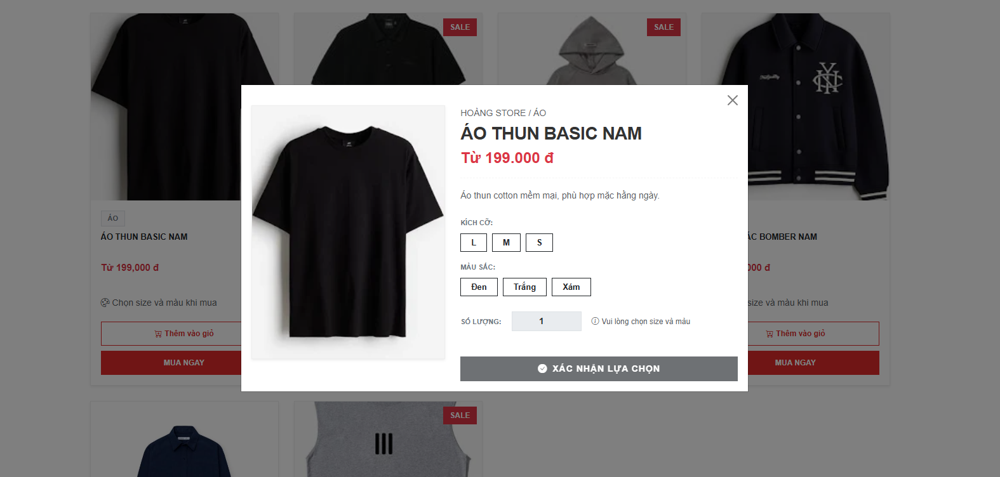
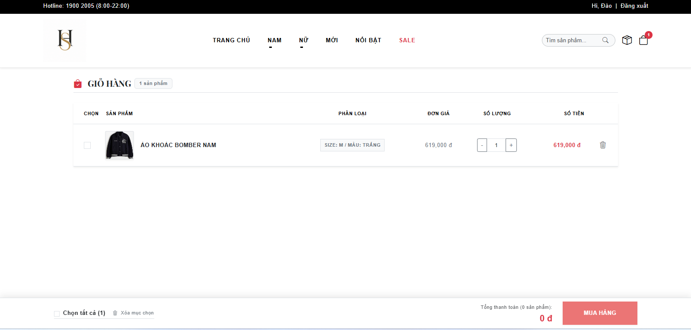
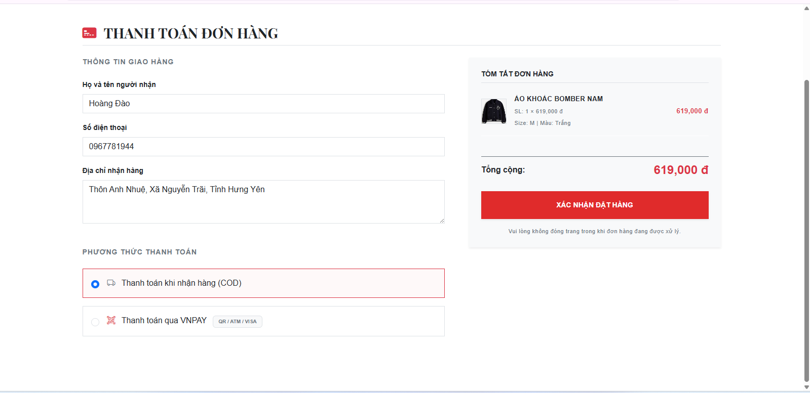
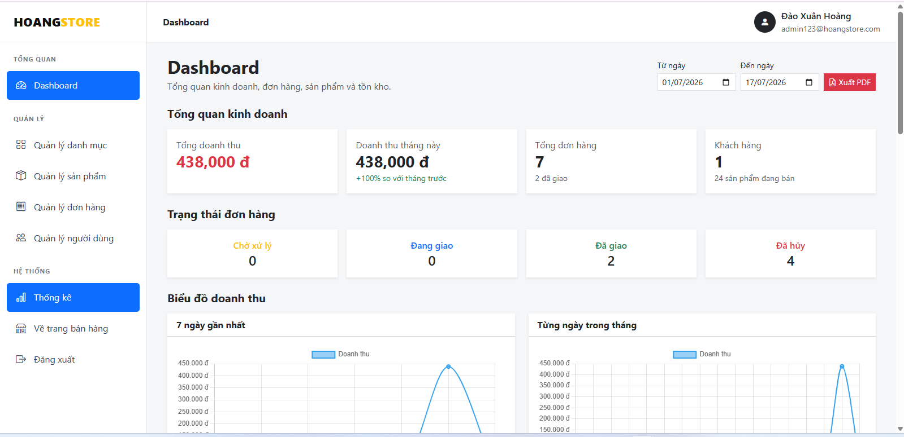
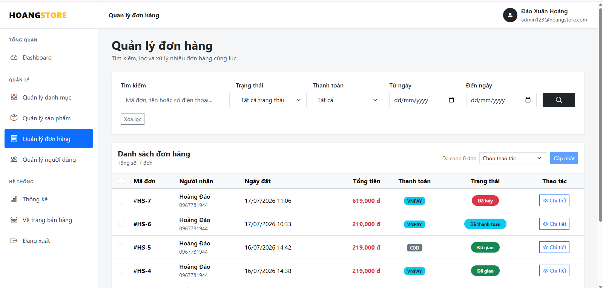

# HoangStore

HoangStore is an e-commerce web application built with ASP.NET Core MVC.  
The project supports product browsing, product variants, shopping cart, checkout, COD and VNPAY payments, order management, and administration features.

## Live Demo

https://hoangstore.runasp.net

## Main Features

### Customer

- Register and log in with ASP.NET Core Identity
- Browse, search, filter, and paginate products
- View product variants by size, color, price, image, and inventory
- Add products to the shopping cart using AJAX
- Update quantities, remove items, and calculate totals in real time
- Checkout with COD or VNPAY Sandbox
- View personal order history

### Administrator

- Manage products, product variants, categories, and inventory
- Manage customer orders and controlled order-status transitions
- Search, filter, and paginate products and orders
- View revenue information
- Soft-delete products and automatically clean obsolete data

## Payment Integration

The project integrates VNPAY Sandbox with:

- HMAC-SHA512 request signing
- Transaction expiration handling
- Payment callback validation
- Automatic payment-status updates
- Automatic cancellation of expired unpaid VNPAY orders

## Tech Stack

- C#
- ASP.NET Core MVC
- Entity Framework Core
- SQL Server
- ASP.NET Core Identity
- JavaScript
- jQuery
- AJAX
- Bootstrap
- VNPAY Sandbox
- Git and GitHub

## Project Structure

```text
Areas/Admin           Admin controllers and views
Controllers           Customer-facing controllers
Data                  Database context and seeders
Migrations            Entity Framework Core migrations
Models                 Entities, enums, services, and view models
ViewComponents        Reusable view components
Views                  Razor views
wwwroot                CSS, JavaScript, images, and static files
```

## Hướng dẫn cài đặt

### Yêu cầu

- .NET 10 SDK
- SQL Server
- Visual Studio 2022 trở lên

### Cài đặt

1. Clone repository:

```bash
git clone https://github.com/hoangdao-89/hoangstore.git
cd hoangstore
```

2. Cấu hình chuỗi kết nối cơ sở dữ liệu bằng User Secrets hoặc file `appsettings.Development.json`.

3. Cập nhật cơ sở dữ liệu bằng Entity Framework Core:

```bash
dotnet ef database update
```

4. Chạy ứng dụng:

```bash
dotnet run
```

## Cấu hình

Ứng dụng cần các giá trị cấu hình sau:

```text
ConnectionStrings:DefaultConnection
Vnpay:TmnCode
Vnpay:HashSecret
Vnpay:ReturnUrl
SystemAdmin:Email
SystemAdmin:Password
```

Không commit mật khẩu, chuỗi kết nối cơ sở dữ liệu hoặc thông tin bí mật của VNPAY lên GitHub.

## Hình ảnh dự án

### Trang chủ


### Xem nhanh sản phẩm



### Giỏ hàng



### Thanh toán



### Trang quản trị



### Quản lý đơn hàng



## Tác giả

**Đào Xuân Hoàng**

- GitHub: https://github.com/hoangdao-89
- Định hướng: Fresher .NET Developer